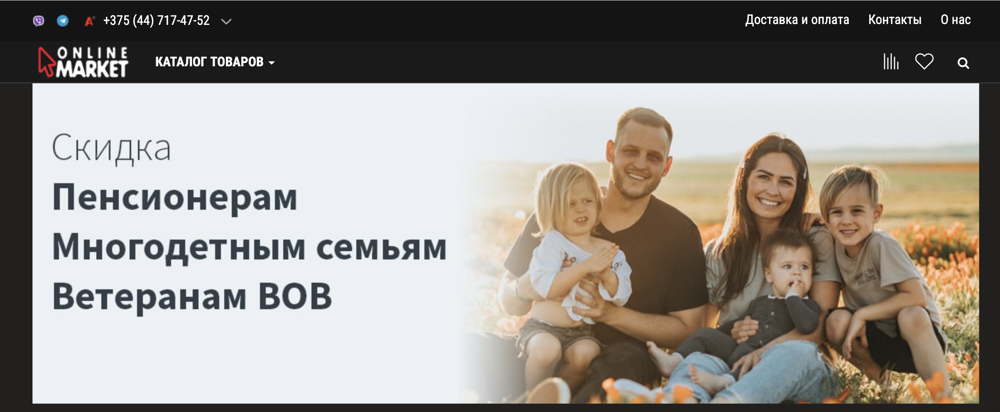

# Проект по тестированию интернет-магазина <a target="_blank" href="https://www.online-market.by/">Online-Market</a>

---

### Список проверок, реализованных в web автотестах

1. Открытие первого монитора в списке.
2. Проверка фильтра "Диагональ" значение "15.6".
3. Добавление монитора в корзину.
4. Удаление монитора из корзины.
5. Добавление монитора в список сравнения.
6. Удаление монитора из списка сравнение.
7. Очистка списка сравнения.
8. Добавление монитора в избранное.
9. Удаление монитора из избранного.
10. Очистка списка избранного.

## Используемый стек технологий и инструментов

|                             Python                             |                             Pytest                             |                             Selene                             |                             Selenoid                             |                              Git                               |                                 Jenkins                                 |                                Allure                                 |                             Allure TestOps                             |                                 PyCharm                                  |                             Telegram                             |
|:--------------------------------------------------------------:|:--------------------------------------------------------------:|:--------------------------------------------------------------:|:----------------------------------------------------------------:|:--------------------------------------------------------------:|:-----------------------------------------------------------------------:|:---------------------------------------------------------------------:|:----------------------------------------------------------------------:|:------------------------------------------------------------------------:|:----------------------------------------------------------------:|
|  |  |  |  |  |  |  |  |  |  |

##  Запуск проекта в Jenkins
#### Для запуска автотестов в Jenkins
1. __Открыть проект <a href="https://jenkins.autotests.cloud/job/online_market_diplom/1/allure/">в Jenkins</a>__
2. __Выбрать пункт `Build with Parameters`__
3. __Результат запуска сборки можно посмотреть в отчете Allure__

##  Отчет в Allure report
>__Просмотр результатов выполнения тестов в Allure report__

>__Отчет позволяет получить общую информацию о прохождении тестов__
> 

>__Отчет позволяет получить информацию о прохождении каждого теста__

__Каждый тесто содержит детальную информацию по всем шагам тестов, включая скриншоты, дам страницы и видео прохождения теста.__
>__Пример видео для теста вебсайта__

### Интеграция с Allure TestOps

> ##  Отчет в Allure report > [Тест-кейсы](https://allure.autotests.cloud/launch/44144/tree/689780?treeId=0)

##  Оповещения в Telegram

